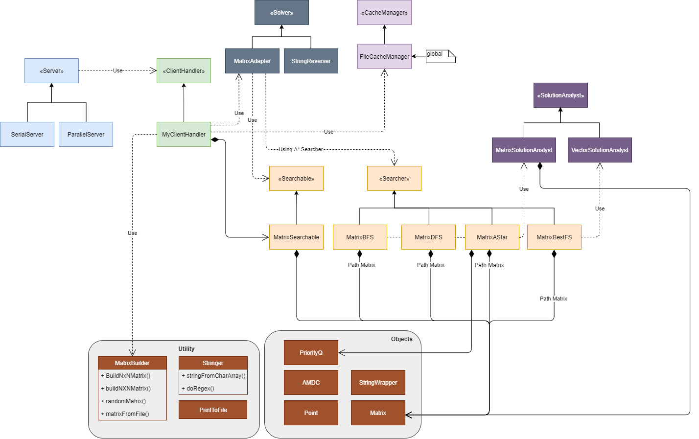

# Shortest Path Finder
By Rony Utevsky and Yehonatan Sofri.  
A C++ project made for Advanced Programming 1 Project Mile stone 2, BIU, Fall 2019.  
[Link to GitHub](https://github.com/yehonatansofri/MS2/)
## System requirements
* Linux OS  


## Installation

If compilation is required, go to project directory (where main.cpp is) and compile using 

```bash
g++ -std=c++14 */*/*.cpp */*.cpp  *.cpp -Wall -Wextra -Wshadow -Wnon-virtual-dtor -pedantic -o a.out -pthread
```

## Usage   
Program runs a server. The Server
accepts client on the given port (default is 5600). After client made a connection, program expects to get a matrix, a startin point and an end point followed by new lines. to end write `end\n`.  
- matrix - Matrix of numbers. should be of size NxN, each line represents a row. Numbers will be seperated by commas.
- Start point- coordinates of starting point - row and column.
- End point - coordinates of end point - row and column  
##### example input #1
```bash
1,2,3
4,5,6
7,8,9
0,0
2,2
end

```
will calculate the shortest path from 1 to 9. notice each line is ending with `'\n'`.  
##### solution  
after entering valid data, an A* algorithm will calculate shortest path from start to end and will write to client the steps and relative weight of steps. for example to the matrix in example input, solution will be:  
```bash
Right (3), Right (6), Down (12), Down (21)
```
##### example input #2
```bash
1
0,0
0,0
end

```
##### solution  

```
You're already there, honey!
```

  
---
## Code Architecture:
<br />
<a href="https://www.draw.io?lightbox=1&highlight=0000ff&edit=_blank&layers=1&nav=1&title=MS2%20Plot.drawio#R7V3tc5s4E%2F9rMvPcM1MPQrx%2BjJ2mvbukl4uba3tfbmQj27QY%2BYAkdv%2F6ExhhkISNbTA4SaZzZ2QQsLu%2FfdNqfQEH8%2BWHAC1mt8TB3oWqOMsLeHWhqkAzFPq%2FeGS1HjENcz0wDVwnPWkzMHR%2F4nQwvW766Do4LJwYEeJF7qI4OCa%2Bj8dRYQwFAXkunjYhXvGuCzTFwsBwjDxx9IvrRLN0VFeUzRcfsTudsVsr7Js5YmenA%2BEMOeQ5NwTfX8BBQEi0%2FjRfDrAXU48R5suvqy%2FezQ%2Fjw29%2Fhv%2Bih%2F7vnz%2F99W492fU%2Bl2TvEGA%2FOnjqxReyuH16R8KbAXkPJsrVdPnrOxuu535C3mNKsYcQp%2B8brRgVse9cxsygR2SB%2FQvYpyMpswElRN9B4QzHNwL0YBbNvfQjfeBg9ZUeKD2dHX7Lf3cVS5qSHa3Y0dKNvrLz6Odvmyno0eai%2BIBdU5FKKTVD8hiM8RbS6EYqriiY4mjLiWZKQ%2BwURDHlwgdM5pi%2BGj0hBZXSM3VKtOSa55xMMqgF2EOR%2B1QUYJTiYJpNl93hjrj0hbPpbSudJ0WsAaweMIuzrF8%2BvTAvM9xcAGi7J1sTSJiMCgxa5U5bxCeE5c8NgFq8l64VBJp%2BWE%2FJXc7mJ5NJiCPuihz9N0MJMPYACVB0ASUCRALy6DsZBJ5nboSHC5RI2DNVrUVYTFzPGxCPBMm1ECd%2FdDyMAvID576BBrShs7dwP%2BEgwssqwqjCItFNXREkE7KxWU5RqkxPyiSzwIF9yW1bL5baus1RG0qorcqorTZGbZHYA%2FXisj%2FEAX2v%2BHO%2FL5A%2FT1ziR8P0G0UktoOwNRnLiG2MLTyaNEhsoBSJDUxNVLpAQmy9KVoDUZBjo8HIR4JoRqbER977zWh%2FI%2BoxeTfn3BCySHnwHUfRKjXH6DEi9djgmu0pYO7fLntqVzSnle3kcTxjcrcBCIWGi7wUINug0Rko6EUkQKV1JOhtIKFuiYbnKdGiz3%2BHAuR5%2BKxkGphdE2pVVBVrWzrwXPryH5HveHWYVB1bjiajuaWOoGE0SHNods2kqvAVm1TmGO9UQEwyO6KB2HPngHK7KoJkDxXUHTi0r4Lga%2FYwVbsiHFjU1RU4iDHYLYoCdznEKBjP0MgTM3LVzcVkgo2x1EQ7pj1S9udDdXwYXASmg9bxoZSY6Bypj7XPHSI4tFsnuFZGcOLVkV8wNNOwTGkyB2hQ19IZCuyJ%2F5oMtjiroGs9S7Fzf3rLPNFes5GAlY2E1ikjAUUjMaQ2wp%2FeYyqa4Q6X6exAZHB5aaC3rcm0Mk02QOMZvkU%2BmtagzzCg%2FqyUFbZhQtSkN2taot4CbRO9lTxRR1SVVnUFUuuWqmLPnUPKtevhAk5eBEKA1gGI6KJLu1mLPYzESNFV1ZFm9a7AdeLBtm0PLLbq3h7dy7J961CiBlvQYiBhdS6QYCun52EJWP3KpmblW%2B6bbtWvMEGuz3rICzwsrpYkqy2ruZDEtPTifUw7P534XPrW88vqTrK7aT0j92cWfSgAe%2FnQzy6%2BcUkdTl2FKzaTlTfMVMOMobeLmX1F3VZPKeq22l1R10Wfc51D7V8Pz9MEm7BryVNDLINb0%2FjqXGls8am69mlcthZwBIE76M6bnPJo3503xTDq8vZq8LLILkRRoO3o1VQFsmfrA4%2BRS%2FxL6nqswujoYMo0DMVCMm5oUL3SzRa4IVRXU4N8Ona4yvDBun9Cz19%2Fus7HT0vvuu9ltUGteYyanQ2sa%2F7j5ZIdfmN8dIcDl5IAB804hmbVUi8mz00HU0K1PARGcY6SaKouh8sUq8jSRWsOuC8LsgrnQUNoiJCFJ9WgZQtDXwK0WByVau2gBRMch9YtmF1Gfwnpw2d37iEfS0g%2Fnrmec4NW5DF%2B4DBC4x%2FsqD8jgfuTno8Y3%2BjXQZSqU9XYwrjNlcN4xvReAQ7ptXeMOYAbukXLwok3KIzYUxLPQ4vQHSXPHV84p2rG9fskisg8Pak70qKBIlpNS%2BJmahJpMa2dCvkejyPkT%2BPanLLbyYTTlNxN5VQ38qgh81GE%2B7FlDZtQ39nmiMIum34irrHwXgdkPpihIMkH%2FO8XQZIpAyKB1T5Zi3ZOGNMh5LlTnx56eBJfFnPQHSPvMh2OYkehHy7QmN76JjnnStuM3KekiocIvXbiJVsRZ67jJJsRAxKhCI0yLKVpE%2Fqgep%2F%2Bo286iJNKOn3wAT0Gm2P6Lz49oFLp03dBbiJ%2FmAr8M46FXiKZ25XAbtFcFXm%2BSxJ52aivDFyRLGAkEuCQezzFyzeu1891XW2d66LfdqEaXvzWI%2FphGn%2F4Y%2FSdKreQjdMbZV%2BViUTOqdhXOsaUyLHfLsjHnHI6CTBk%2B%2FuKQUdTBsTids6Y0BQYKOVfYxtnFDHRKfDvIXI9N1q98Y9aZH57a9v8A6LdrXXH%2FX6U3BmmNrBBXeV4Amyrp3P%2BVtUN6sKGFMlcDQfC4JXv6qy6rbNj9ZRAsrFzncC4dNAiemn1lDoPulPWUz493bgTS%2F3579%2Fo8enhd0V3P7vvrFZQc9I1Zul7nypBqOi7Vmsl3%2B6rfy16E9swTQ3YVK4taBVuommwkireu1UIn4Wrdd37AMMgZbR9TmahA8DQKhqSU9UrAWCpPVAzgvbvimOp3Rd1tcyUDik3jzCkLZYGbBqBtVEbsA0gYokLDqNzrcCg3jMPq7bXQGWJ0Z3RWUEFFwK1JFfPznZcNCe%2B83nm%2BlwaH2hs4Nr1sql2GowdKbZRmpcv0e%2BgIf2%2BdZtr1T5pbGK20nZRR%2FCpG0VUG3ykX9nzMYtyaytqI76OwelzEyhbn4v6RspxF7A3qctiyAsNBJDdxf0WVaWk2umsEUfd4hzmeopibMVdfNBwPQMr5auMRaVnmdzqVgboYxsWckWsBtvO1FVI2uzFuwHJhlohSmErWzw4e6Qejq2jAvwmzZwgQYZBEdxtWLVkiMT1lO2WSFwwqb4QktRTlC5ZxquSHhphr4%2FGP6ZJKqBainArVHlXPOu1nD7HRb6bcZnuN7QCZ0AtQsqQwuwJlyxqTouJgdQLdj5O4O5vi1b38DAMQ9U4iahH0IDCZb8Nu%2BNePwBW0Sy8Ih9jX4X8hs4jdofuEwDYBh8A6LXA01TPDJ38DtNXBE5TAOeLwqPZGiAr7zAwupBGAyrXyRxah2LWkkt6%2FRZVh4UbadoODGpcqnDvC%2BqOX%2Fo%2Fnct%2Fhui7p%2Fwd%2FnFPTHQf%2FiPJVjf1Ax7qYb%2Fg0VMUmF9S7AFVOzD9xYl8G51U07IREW0NFEppHDQgOBBjOmdNVNantGaM6dz6PyyauWYAoL5Ii5TBLo%2B53Jr%2B1uquDuBknSI9rVES8AIPxIuh7ZioLrxwYSncYWH483VY79q%2BFF%2FtdmADrcm%2FlBhVa1TWLdBE8a%2B9tnHbU%2BZU4tQjI%2BQJnAxnaBF%2F9EkUs23H7%2BiEOdUn38vBqbd0I8fnhOnvNp3ZJDnJahwq1Sc2F0IC3ZB1ZmOGue6tFlIuiHmMej2zg5MIzZmHPaqBd%2BacVdbLvAHPSucsRbYHYF9LYfI7%2BPmJ6rIUXOpFA5Ua99SaD5AKuZgPeAgp5OnQ5f%2Fpf7JeeA2I%2FR6xellVpHI6c3IkXvTThR18Ok49OB3Ho4yfqC5w2MXIHhrb3Si%2BRJI7vxk3qul9P%2FX%2B0qaWxexnGKOXOV9dDtGFkIOfqCasWJCT%2FXTJrVnZ10Q5724pfI1yLKdGVTle95JpK4hgj5lTWH%2FhcUSCDjV4qT%2BQAPzuxJM2eJEzQmy712HLUeU3mmvBVtU9JFuE%2ByQmAvC%2FvqgfGmwAfjezMFNdayWqWbQSJ0k0AbGRzl3gksCNVn8eoWSObmJUv5Lh2%2FDJfnS5sT0P8iT6C9%2F0AMAewWKzvu22mtHdequFtLrNLfUah6bVKRN2zFRbJSkoRoRmqs%2BaXYiS7GkI6HN9JvGvX7wsDSZ0upL1b2U%2FWZTXYJDbJlmfBivrR9h%2FdD3nrRdb6yLDu0GVe7EBXktUa8ZW5X6nb8Yml11xwWbdiSuR3U%2FLT2tJfvUNuXYI5Ra9IErlqsjtUzTkkj%2BfGN2teT9KeP81x3v6CHFaqLyJ05sYHCoGp%2BzLJn0%2BttjFiUHcClsJkO%2BQ%2BZsOaIr5rNlne8wv68Q4T3ge9%2BKMXcg33tfPeyD7ye7TMl90XBtoCHfaZZm9ONFAzg1yS5jaodXJ%2FPqOMFFNESv%2FwFA9KuFGDwNCovzpAVrMbomD4zP%2BAw%3D%3D" target="_blank"></a>
  
main thread will run a parallel server, allowing to handle multiple clients at the same time.
each connection will create a new thread.  
## Data structures 

### File Cache Manager  

Contains a map of strings and booleans, each string is a file name that is stored in the `cached_solutions` folder. boolean marks if the file is in the folder or not.

---
## Contributing
Pull requests are welcome. For major changes, please open an issue first to discuss what you would like to change.

Please make sure to update tests as appropriate.

---  

## License
Open source, free license (unless you're a BIU student...)
